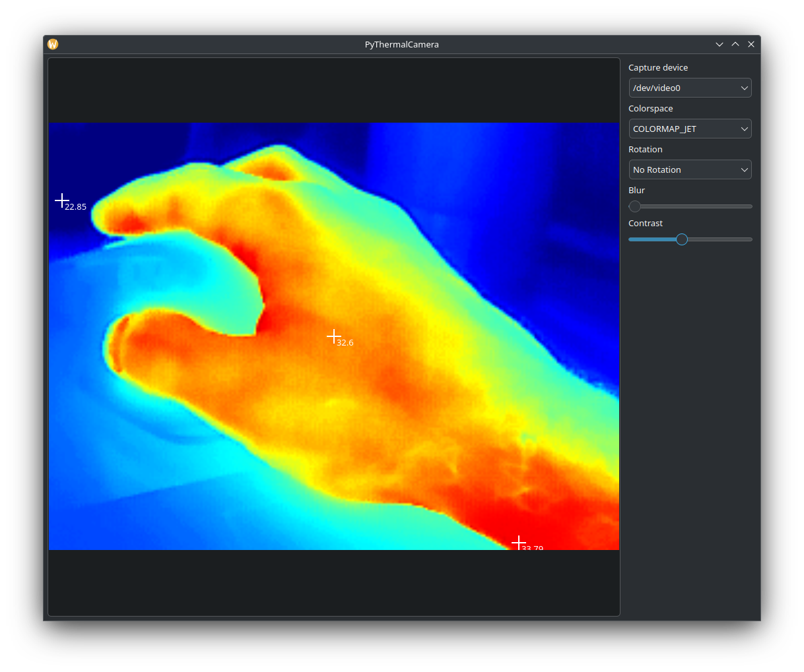

# PyThermalcam
Python Software to use the Topdon TS001 Thermal Camera on Linux and the Raspberry Pi. It **may** work with other similar cameras! Please feed back if it does!

Huge kudos to LeoDJ on the EEVBlog forum for reverse engineering the image format from these kind of cameras (InfiRay P2 Pro) to get the raw temperature data!
https://www.eevblog.com/forum/thermal-imaging/infiray-and-their-p2-pro-discussion/200/
Check out Leo's Github here: https://github.com/LeoDJ/P2Pro-Viewer/tree/main

Also thanks to Les Wright https://github.com/leswright1977/PyThermalCamera


## Introduction

This is a rewrite of Les's python utility for Topdon cameras. I've tried to lay some groundwork to make it easy to work with the camera.


This program, and associated information is Open Source (see Licence). 

## Features
The following features have been implemented:


- Bicubic interpolation to scale the small 256*192 image to something more presentable! Available scaling multiplier range from 1-5 (Note: This will not auto change the window size on the Pi (openCV needs recompiling), however you can manually resize). Optional blur can be applied if you want to smooth out the pixels.
- False coloring of the video image is provided. the avilable colormaps are listed on the right.
- Variable Contrast.
- Center of scene temperature monitoring (Crosshairs).
- Floating Maximum and Minimum temperature values within the scene
- Custom measurements - click to add, right click to remove all

## Dependencies

- Python3
- OpenCV
- pyqt

## Running the Program

```
/usr/bin/python3.13 /home/witko/Development/Personal/Python/PyThermalCamera/src/main.py
```
